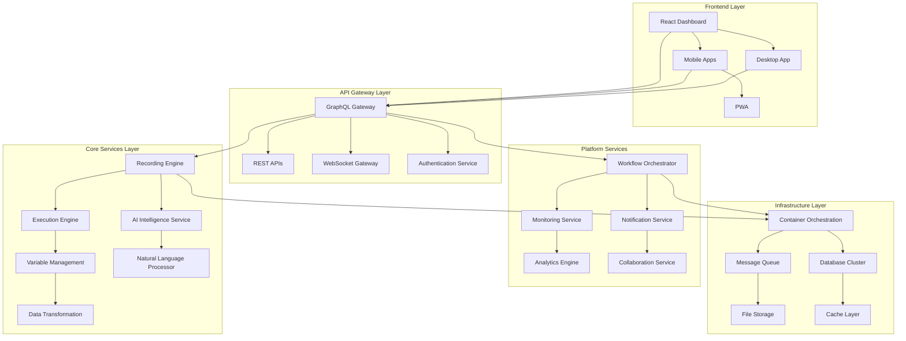

# Design Document

## Overview

This design document outlines the architecture and implementation strategy to transform our current AI RPA Recorder into the market-leading AI RPA platform. The design focuses on creating a scalable, enterprise-ready solution that combines cutting-edge AI capabilities with robust execution engines and intuitive user experiences.

## Architecture

### High-Level System Architecture



### Microservices Architecture

The system will be decomposed into specialized microservices for scalability and maintainability:

1. **Frontend Services**
   - React Dashboard Service
   - Mobile API Service
   - Real-time Communication Service

2. **Core Automation Services**
   - Recording Engine Service
   - Execution Engine Service
   - AI Intelligence Service
   - Variable Management Service

3. **Platform Services**
   - User Management Service
   - Workflow Orchestration Service
   - Monitoring & Analytics Service
   - Notification Service

4. **Integration Services**
   - Connector Hub Service
   - Data Integration Service
   - External API Gateway

## Components and Interfaces

### 1. Next-Generation Frontend Architecture

#### Modern React Dashboard
```typescript
// Core Dashboard Architecture
interface DashboardState {
  theme: 'light' | 'dark' | 'auto';
  layout: 'grid' | 'list' | 'kanban';
  filters: AutomationFilter[];
  realTimeUpdates: boolean;
}

interface AutomationCard {
  id: string;
  name: string;
  status: ExecutionStatus;
  thumbnail: string;
  metrics: PerformanceMetrics;
  lastRun: Date;
  nextScheduled?: Date;
}
```

#### Component Structure
```
src/
├── components/
│   ├── dashboard/
│   │   ├── AutomationGrid.tsx
│   │   ├── MetricsDashboard.tsx
│   │   └── QuickActions.tsx
│   ├── recording/
│   │   ├── RecordingStudio.tsx
│   │   ├── ActionCapture.tsx
│   │   └── VariableExtractor.tsx
│   ├── execution/
│   │   ├── ExecutionMonitor.tsx
│   │   ├── LogViewer.tsx
│   │   └── DebugConsole.tsx
│   └── collaboration/
│       ├── TeamWorkspace.tsx
│       ├── VersionControl.tsx
│       └── ReviewSystem.tsx
```

#### Mobile-First Design System
```scss
// Design tokens for consistent theming
:root {
  --primary-gradient: linear-gradient(135deg, #667eea 0%, #764ba2 100%);
  --success-gradient: linear-gradient(135deg, #4facfe 0%, #00f2fe 100%);
  --warning-gradient: linear-gradient(135deg, #fa709a 0%, #fee140 100%);
  --error-gradient: linear-gradient(135deg, #ff6b6b 0%, #ee5a24 100%);
  
  --shadow-sm: 0 2px 4px rgba(0,0,0,0.1);
  --shadow-md: 0 4px 12px rgba(0,0,0,0.15);
  --shadow-lg: 0 8px 24px rgba(0,0,0,0.2);
  
  --border-radius: 12px;
  --transition: all 0.3s cubic-bezier(0.4, 0, 0.2, 1);
}
```

### 2. Advanced Recording Engine

#### Multi-Strategy Element Capture
```typescript
interface ElementCapture {
  strategies: {
    css: string[];
    xpath: string[];
    accessibility: AccessibilitySelector;
    visual: VisualFingerprint;
    semantic: SemanticContext;
  };
  confidence: number;
  fallbackOrder: string[];
}

interface VisualFingerprint {
  screenshot: string;
  boundingBox: Rectangle;
  visualHash: string;
  surroundingContext: ContextElement[];
}

interface SemanticContext {
  role: string;
  label: string;
  purpose: string;
  businessContext: string;
}
```

#### Recording Studio Interface
```typescript
class RecordingStudio {
  private captureEngine: CaptureEngine;
  private aiAnalyzer: AIAnalyzer;
  private variableExtractor: VariableExtractor;
  
  async startRecording(options: RecordingOptions): Promise<RecordingSession> {
    const session = new RecordingSession();
    
    // Initialize multi-strategy capture
    await this.captureEngine.initialize({
      strategies: ['dom', 'visual', 'accessibility'],
      quality: options.quality || 'high',
      optimization: options.optimization || 'balanced'
    });
    
    // Start AI-powered analysis
    this.aiAnalyzer.startRealTimeAnalysis(session);
    
    return session;
  }
  
  async processAction(action: UserAction): Promise<ProcessedAction> {
    // Multi-strategy element identification
    const element = await this.captureEngine.identifyElement(action.target);
    
    // AI-powered action optimization
    const optimized = await this.aiAnalyzer.optimizeAction(action, element);
    
    // Variable extraction suggestions
    const variables = await this.variableExtractor.suggestVariables(optimized);
    
    return {
      ...optimized,
      element,
      suggestedVariables: variables
    };
  }
}
```

### 3. Intelligent Execution Engine

#### Self-Healing Automation Engine
```typescript
interface ExecutionEngine {
  strategies: ElementFindingStrategy[];
  selfHealing: SelfHealingConfig;
  adaptiveWaits: AdaptiveWaitConfig;
  errorRecovery: ErrorRecoveryConfig;
}

class SelfHealingEngine {
  async findElement(selector: ElementSelector): Promise<Element | null> {
    // Primary strategy
    let element = await this.tryPrimarySelector(selector);
    if (element) return element;
    
    // AI-powered fallback strategies
    for (const strategy of this.fallbackStrategies) {
      element = await strategy.find(selector);
      if (element) {
        // Learn from successful fallback
        await this.updateSelectorStrategy(selector, strategy);
        return element;
      }
    }
    
    // Visual similarity matching
    if (selector.visualFingerprint) {
      element = await this.findByVisualSimilarity(selector.visualFingerprint);
      if (element) return element;
    }
    
    // Semantic matching
    element = await this.findBySemanticContext(selector.semanticContext);
    return element;
  }
  
  private async updateSelectorStrategy(
    selector: ElementSelector, 
    successfulStrategy: ElementFindingStrategy
  ): Promise<void> {
    // Machine learning to improve selector reliability
    await this.mlModel.updateSelectorWeights(selector, successfulStrategy);
  }
}
```

#### Adaptive Timing System
```typescript
class AdaptiveTimingController {
  private networkConditions: NetworkConditions;
  private pageComplexity: PageComplexityMetrics;
  private historicalData: TimingHistoryData;
  
  async calculateOptimalWait(action: Action, context: ExecutionContext): Promise<WaitStrategy> {
    const baseWait = this.getBaseWaitTime(action.type);
    const networkMultiplier = this.getNetworkMultiplier();
    const complexityMultiplier = this.getComplexityMultiplier(context.page);
    
    return {
      timeout: baseWait * networkMultiplier * complexityMultiplier,
      strategy: this.selectWaitStrategy(action, context),
      fallbackStrategies: this.getFallbackStrategies(action)
    };
  }
  
  private selectWaitStrategy(action: Action, context: ExecutionContext): WaitType {
    if (action.type === 'navigation') return 'networkidle';
    if (action.type === 'click' && context.hasAjax) return 'domcontentloaded';
    if (action.type === 'type') return 'element-stable';
    return 'element-visible';
  }
}
```

### 4. AI Intelligence Service

#### Natural Language to Automation Converter
```typescript
class NLPAutomationGenerator {
  private llmClient: LLMClient;
  private workflowTemplates: WorkflowTemplate[];
  private domainKnowledge: DomainKnowledgeBase;
  
  async generateAutomation(description: string): Promise<AutomationWorkflow> {
    // Parse natural language intent
    const intent = await this.parseIntent(description);
    
    // Extract entities and parameters
    const entities = await this.extractEntities(description);
    
    // Generate workflow steps
    const steps = await this.generateSteps(intent, entities);
    
    // Optimize and validate workflow
    const optimized = await this.optimizeWorkflow(steps);
    
    return {
      name: this.generateName(intent),
      description,
      steps: optimized,
      variables: this.extractVariables(entities),
      metadata: {
        confidence: this.calculateConfidence(intent, steps),
        suggestedImprovements: await this.suggestImprovements(optimized)
      }
    };
  }
  
  private async parseIntent(description: string): Promise<AutomationIntent> {
    const prompt = `
      Analyze this automation request and extract the intent:
      "${description}"
      
      Return structured intent with:
      - Primary action (navigate, extract, fill, click, etc.)
      - Target application/website
      - Data requirements
      - Success criteria
    `;
    
    return await this.llmClient.analyze(prompt);
  }
}
```

#### Intelligent Error Diagnosis
```typescript
class AIErrorDiagnostics {
  async diagnoseFailure(
    error: ExecutionError, 
    context: ExecutionContext
  ): Promise<DiagnosisResult> {
    const analysis = await this.analyzeError(error, context);
    const suggestions = await this.generateSuggestions(analysis);
    const autoFix = await this.attemptAutoFix(error, suggestions);
    
    return {
      diagnosis: analysis.diagnosis,
      confidence: analysis.confidence,
      suggestions: suggestions,
      autoFixAttempted: autoFix.attempted,
      autoFixSuccess: autoFix.success,
      recommendedActions: this.prioritizeActions(suggestions)
    };
  }
  
  private async analyzeError(
    error: ExecutionError, 
    context: ExecutionContext
  ): Promise<ErrorAnalysis> {
    const prompt = `
      Analyze this automation failure:
      
      Error: ${error.message}
      Stack: ${error.stack}
      Context: ${JSON.stringify(context, null, 2)}
      
      Provide:
      1. Root cause analysis
      2. Confidence level (0-100)
      3. Error category (element-not-found, timing, network, etc.)
      4. Suggested fixes
    `;
    
    return await this.llmClient.analyze(prompt);
  }
}
```

### 5. Enterprise Management Platform

#### Real-Time Monitoring Dashboard
```typescript
interface MonitoringDashboard {
  metrics: {
    executionsPerMinute: number;
    successRate: number;
    averageExecutionTime: number;
    resourceUtilization: ResourceMetrics;
    errorDistribution: ErrorMetrics[];
  };
  alerts: Alert[];
  healthChecks: HealthCheck[];
}

class MonitoringService {
  private metricsCollector: MetricsCollector;
  private alertManager: AlertManager;
  private dashboardUpdater: DashboardUpdater;
  
  async startMonitoring(): Promise<void> {
    // Real-time metrics collection
    this.metricsCollector.start({
      interval: 1000, // 1 second
      metrics: ['execution', 'performance', 'errors', 'resources']
    });
    
    // Alert processing
    this.alertManager.start({
      rules: await this.loadAlertRules(),
      channels: ['email', 'slack', 'webhook', 'sms']
    });
    
    // Dashboard updates
    this.dashboardUpdater.start({
      updateInterval: 5000, // 5 seconds
      clients: await this.getConnectedClients()
    });
  }
}
```

#### Role-Based Access Control
```typescript
interface RBACSystem {
  roles: Role[];
  permissions: Permission[];
  policies: AccessPolicy[];
}

class AccessControlService {
  async checkPermission(
    user: User, 
    resource: Resource, 
    action: Action
  ): Promise<boolean> {
    const userRoles = await this.getUserRoles(user);
    const requiredPermissions = await this.getRequiredPermissions(resource, action);
    
    for (const role of userRoles) {
      const rolePermissions = await this.getRolePermissions(role);
      if (this.hasRequiredPermissions(rolePermissions, requiredPermissions)) {
        return true;
      }
    }
    
    return false;
  }
  
  async enforceDataPrivacy(data: any, user: User): Promise<any> {
    const privacyRules = await this.getPrivacyRules(user);
    return this.applyPrivacyFilters(data, privacyRules);
  }
}
```

## Data Models

### Core Data Structures

```typescript
// Automation Workflow Model
interface AutomationWorkflow {
  id: string;
  name: string;
  description: string;
  version: string;
  status: WorkflowStatus;
  steps: WorkflowStep[];
  variables: Variable[];
  metadata: WorkflowMetadata;
  permissions: AccessPermissions;
  schedule?: ScheduleConfig;
  tags: string[];
  createdAt: Date;
  updatedAt: Date;
  createdBy: string;
  lastModifiedBy: string;
}

// Enhanced Variable System
interface Variable {
  id: string;
  name: string;
  type: VariableType;
  value: any;
  defaultValue?: any;
  validation: ValidationRule[];
  encryption: EncryptionConfig;
  source: VariableSource;
  transformations: DataTransformation[];
  metadata: VariableMetadata;
}

// Execution Context
interface ExecutionContext {
  id: string;
  workflowId: string;
  status: ExecutionStatus;
  startTime: Date;
  endTime?: Date;
  currentStep: number;
  totalSteps: number;
  variables: Record<string, any>;
  logs: ExecutionLog[];
  metrics: ExecutionMetrics;
  environment: ExecutionEnvironment;
  user: string;
  sessionId: string;
}

// AI Analysis Results
interface AIAnalysisResult {
  confidence: number;
  suggestions: Suggestion[];
  optimizations: Optimization[];
  risks: Risk[];
  alternatives: Alternative[];
  learningData: LearningData;
}
```

## Error Handling

### Comprehensive Error Management System

```typescript
class ErrorHandlingSystem {
  private errorClassifier: ErrorClassifier;
  private recoveryStrategies: RecoveryStrategy[];
  private notificationService: NotificationService;
  
  async handleError(error: Error, context: ExecutionContext): Promise<ErrorHandlingResult> {
    // Classify error type and severity
    const classification = await this.errorClassifier.classify(error, context);
    
    // Determine recovery strategy
    const strategy = this.selectRecoveryStrategy(classification);
    
    // Attempt recovery
    const recoveryResult = await this.attemptRecovery(error, strategy, context);
    
    // Log and notify
    await this.logError(error, classification, recoveryResult);
    await this.notifyStakeholders(error, classification, recoveryResult);
    
    return {
      classification,
      recoveryAttempted: true,
      recoverySuccess: recoveryResult.success,
      nextAction: recoveryResult.nextAction
    };
  }
  
  private selectRecoveryStrategy(classification: ErrorClassification): RecoveryStrategy {
    switch (classification.category) {
      case 'element-not-found':
        return new ElementRecoveryStrategy();
      case 'timing-issue':
        return new TimingRecoveryStrategy();
      case 'network-error':
        return new NetworkRecoveryStrategy();
      case 'permission-denied':
        return new PermissionRecoveryStrategy();
      default:
        return new GenericRecoveryStrategy();
    }
  }
}

// Error Recovery Strategies
abstract class RecoveryStrategy {
  abstract async recover(error: Error, context: ExecutionContext): Promise<RecoveryResult>;
}

class ElementRecoveryStrategy extends RecoveryStrategy {
  async recover(error: Error, context: ExecutionContext): Promise<RecoveryResult> {
    // Try alternative selectors
    const alternatives = await this.findAlternativeSelectors(context);
    
    for (const selector of alternatives) {
      try {
        const element = await context.page.$(selector);
        if (element) {
          return { success: true, nextAction: 'continue', data: { selector } };
        }
      } catch (e) {
        continue;
      }
    }
    
    // Try visual matching
    const visualMatch = await this.tryVisualMatching(context);
    if (visualMatch.success) {
      return visualMatch;
    }
    
    return { success: false, nextAction: 'pause', reason: 'Element not recoverable' };
  }
}
```

## Testing Strategy

### Comprehensive Testing Framework

```typescript
// Test Architecture
interface TestSuite {
  unitTests: UnitTest[];
  integrationTests: IntegrationTest[];
  e2eTests: E2ETest[];
  performanceTests: PerformanceTest[];
  securityTests: SecurityTest[];
  accessibilityTests: AccessibilityTest[];
}

// Automated Testing Pipeline
class TestingPipeline {
  async runFullTestSuite(): Promise<TestResults> {
    const results: TestResults = {
      unit: await this.runUnitTests(),
      integration: await this.runIntegrationTests(),
      e2e: await this.runE2ETests(),
      performance: await this.runPerformanceTests(),
      security: await this.runSecurityTests(),
      accessibility: await this.runAccessibilityTests()
    };
    
    return results;
  }
  
  private async runE2ETests(): Promise<E2ETestResults> {
    const scenarios = [
      'user-registration-flow',
      'complex-data-extraction',
      'multi-step-form-filling',
      'error-recovery-scenarios',
      'concurrent-execution-tests'
    ];
    
    const results = [];
    for (const scenario of scenarios) {
      const result = await this.executeE2EScenario(scenario);
      results.push(result);
    }
    
    return {
      total: scenarios.length,
      passed: results.filter(r => r.status === 'passed').length,
      failed: results.filter(r => r.status === 'failed').length,
      details: results
    };
  }
}

// Performance Testing
class PerformanceTestSuite {
  async testConcurrentExecutions(concurrency: number): Promise<PerformanceResult> {
    const startTime = Date.now();
    const promises = [];
    
    for (let i = 0; i < concurrency; i++) {
      promises.push(this.executeTestAutomation());
    }
    
    const results = await Promise.allSettled(promises);
    const endTime = Date.now();
    
    return {
      concurrency,
      duration: endTime - startTime,
      successRate: results.filter(r => r.status === 'fulfilled').length / concurrency,
      averageExecutionTime: this.calculateAverageTime(results),
      resourceUtilization: await this.getResourceMetrics()
    };
  }
}
```

## Implementation Phases

### Phase 1: Foundation (Weeks 1-4)
- Modern React dashboard with design system
- Enhanced recording engine with multi-strategy capture
- Basic AI intelligence integration
- Improved error handling and recovery

### Phase 2: Intelligence (Weeks 5-8)
- Advanced AI-powered features
- Self-healing execution engine
- Natural language automation generation
- Intelligent variable extraction

### Phase 3: Enterprise (Weeks 9-12)
- Monitoring and analytics platform
- Role-based access control
- Collaboration features
- Performance optimization

### Phase 4: Scale (Weeks 13-16)
- Mobile applications
- Advanced integrations
- Enterprise deployment
- Comprehensive testing and documentation

This design provides a comprehensive roadmap for transforming your AI RPA solution into a market-leading platform that can compete with industry giants while maintaining the innovative edge of AI-powered automation.