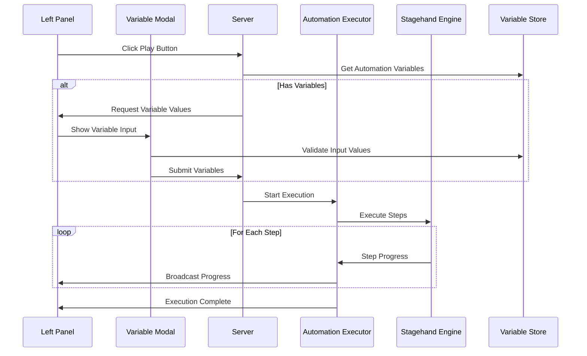
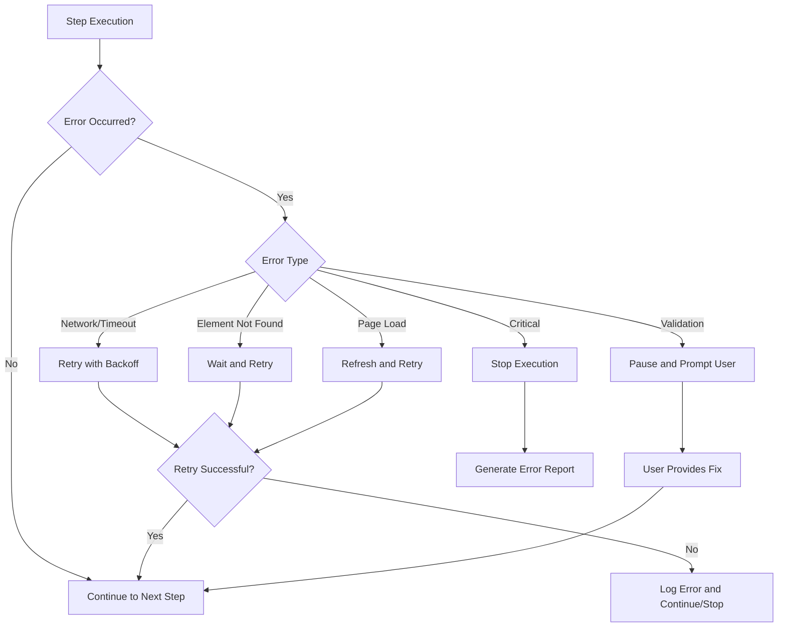

# Design Document

## Overview

The automation replay enhancement will improve the existing play button functionality in the left panel by adding comprehensive execution management, real-time progress tracking, enhanced variable handling, and robust error recovery. The design builds upon the existing workflow engine, variable store, and UI components while adding new capabilities for a superior user experience.

## Architecture

### Core Components

1. **Enhanced Automation Executor** - Extends the existing `handleRunAutomation` in server.js
2. **Execution Progress Manager** - New component for tracking and broadcasting execution state
3. **Variable Input Modal** - Enhanced UI for variable value collection and validation
4. **Execution Status Display** - Real-time progress indicators in the UI
5. **Error Recovery System** - Leverages existing error recovery with automation-specific enhancements

### System Flow



## Components and Interfaces

### 1. Enhanced Automation Executor

**Location**: `server.js` (extend existing `handleRunAutomation`)

**Key Enhancements**:
- Progress tracking with step-by-step updates
- Pause/resume functionality
- Enhanced error handling with recovery options
- Variable substitution with validation
- Execution logging and screenshots

**Interface**:
```javascript
class EnhancedAutomationExecutor {
    async executeAutomation(automationId, variables, options = {}) {
        // Returns execution context with control methods
    }
    
    async pauseExecution(executionId) {
        // Pause at current step completion
    }
    
    async resumeExecution(executionId) {
        // Resume from paused state
    }
    
    async stopExecution(executionId) {
        // Immediately stop execution
    }
    
    getExecutionStatus(executionId) {
        // Return current execution state
    }
}
```

### 2. Execution Progress Manager

**Location**: `modules/execution/progress-manager.js` (new)

**Responsibilities**:
- Track execution state across multiple automations
- Broadcast real-time progress updates via WebSocket
- Manage execution history and logs
- Handle execution control commands

**Interface**:
```javascript
class ExecutionProgressManager extends EventEmitter {
    startExecution(executionId, automationId, totalSteps) {
        // Initialize execution tracking
    }
    
    updateProgress(executionId, currentStep, stepResult) {
        // Update and broadcast progress
    }
    
    completeExecution(executionId, result) {
        // Mark execution as complete
    }
    
    failExecution(executionId, error) {
        // Handle execution failure
    }
}
```

### 3. Variable Input Modal Component

**Location**: `public/src/components/automation/VariableInputModal.tsx` (new)

**Features**:
- Dynamic form generation based on variable definitions
- Real-time validation with visual feedback
- Variable value persistence and profiles
- Template suggestions and auto-completion

**Interface**:
```typescript
interface VariableInputModalProps {
    automation: Automation;
    variables: Variable[];
    isOpen: boolean;
    onSubmit: (values: Record<string, string>) => void;
    onCancel: () => void;
    savedProfiles?: VariableProfile[];
}
```

### 4. Execution Status Display

**Location**: `public/src/components/automation/ExecutionStatusDisplay.tsx` (new)

**Features**:
- Progress bar with step indicators
- Current action display
- Pause/resume/stop controls
- Error display with retry options
- Execution time tracking

**Interface**:
```typescript
interface ExecutionStatusProps {
    executionId: string;
    status: ExecutionStatus;
    onPause: () => void;
    onResume: () => void;
    onStop: () => void;
    onRetry?: () => void;
}
```

### 5. Enhanced Left Panel Integration

**Location**: `public/src/components/layout/LeftPanel.tsx` (modify existing)

**Enhancements**:
- Dynamic play button states (play/pause/stop)
- Inline progress indicators for running automations
- Quick access to execution logs
- Variable profile selection

## Data Models

### Execution Context

```typescript
interface ExecutionContext {
    executionId: string;
    automationId: string;
    status: 'pending' | 'running' | 'paused' | 'completed' | 'failed' | 'cancelled';
    currentStep: number;
    totalSteps: number;
    startTime: Date;
    endTime?: Date;
    variables: Record<string, string>;
    results: StepResult[];
    errors: ExecutionError[];
    logs: ExecutionLog[];
}
```

### Variable Profile

```typescript
interface VariableProfile {
    id: string;
    name: string;
    automationId: string;
    values: Record<string, string>;
    created: Date;
    lastUsed: Date;
}
```

### Step Result

```typescript
interface StepResult {
    stepIndex: number;
    stepId: string;
    action: string;
    status: 'success' | 'failed' | 'skipped';
    duration: number;
    screenshot?: string;
    extractedData?: any;
    error?: string;
}
```

## Error Handling

### Error Recovery Strategy

1. **Network Errors**: Automatic retry with exponential backoff
2. **Element Not Found**: Wait and retry with alternative selectors
3. **Page Load Errors**: Refresh and retry navigation
4. **Validation Errors**: Pause execution and prompt for correction
5. **Critical Errors**: Stop execution with detailed error report

### Error Recovery Flow



## Testing Strategy

### Unit Tests

1. **Execution Manager Tests**
   - Test execution lifecycle management
   - Test pause/resume functionality
   - Test error handling and recovery

2. **Variable Input Tests**
   - Test form validation
   - Test variable substitution
   - Test profile management

3. **Progress Tracking Tests**
   - Test real-time updates
   - Test WebSocket communication
   - Test state persistence

### Integration Tests

1. **End-to-End Execution Tests**
   - Test complete automation replay
   - Test variable handling throughout execution
   - Test error scenarios and recovery

2. **UI Integration Tests**
   - Test play button state changes
   - Test progress display updates
   - Test modal interactions

### Performance Tests

1. **Concurrent Execution Tests**
   - Test multiple automation executions
   - Test resource management
   - Test WebSocket performance

2. **Large Automation Tests**
   - Test automations with many steps
   - Test memory usage during execution
   - Test execution time optimization

## Implementation Phases

### Phase 1: Core Execution Enhancement
- Enhance existing `handleRunAutomation` method
- Add execution progress tracking
- Implement basic pause/resume functionality

### Phase 2: Variable Management
- Create variable input modal
- Add variable validation and profiles
- Integrate with existing variable store

### Phase 3: UI Integration
- Update left panel with enhanced controls
- Add execution status display
- Implement real-time progress updates

### Phase 4: Error Handling & Recovery
- Implement comprehensive error recovery
- Add execution logging and screenshots
- Create error reporting system

### Phase 5: Advanced Features
- Add execution history and analytics
- Implement variable profile management
- Add execution scheduling capabilities

## Security Considerations

1. **Variable Security**
   - Encrypt sensitive variable values
   - Implement secure variable transmission
   - Add audit logging for variable access

2. **Execution Security**
   - Validate automation steps before execution
   - Implement execution sandboxing
   - Add rate limiting for automation execution

3. **Data Protection**
   - Secure execution logs and screenshots
   - Implement data retention policies
   - Add user permission controls

## Performance Optimizations

1. **Execution Efficiency**
   - Optimize step execution timing
   - Implement smart waiting strategies
   - Add execution caching where appropriate

2. **UI Responsiveness**
   - Use efficient WebSocket communication
   - Implement progressive loading for large automations
   - Add virtual scrolling for execution logs

3. **Resource Management**
   - Limit concurrent executions
   - Implement memory cleanup for completed executions
   - Add execution timeout management