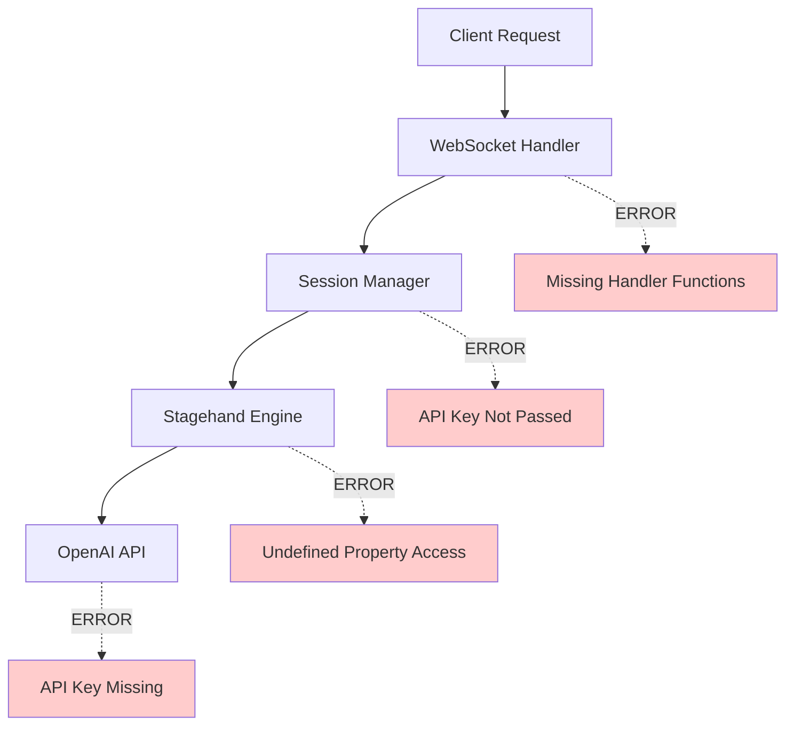
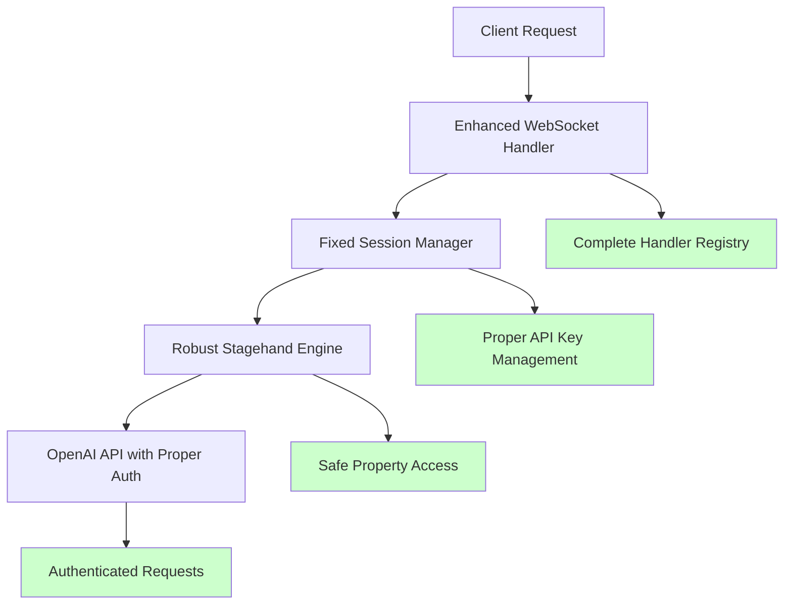

# Automation System Debugging Design

## Overview

This design document outlines the systematic approach to debug and fix the critical issues in the browser automation system. The fixes will enable proper Playwright MCP testing and ensure reliable automation execution.

## Architecture

### Current System Issues Analysis



### Target Fixed Architecture



## Components and Interfaces

### 1. API Key Management System

**Purpose**: Ensure OpenAI API key is properly loaded and passed through the system

**Interface**:
```javascript
class APIKeyManager {
    static loadAPIKey() // Load from .env file
    static validateAPIKey(key) // Validate key format
    static getConfiguredKey() // Get key for Stagehand
}
```

**Implementation Strategy**:
- Check multiple sources: .env file, environment variables, config files
- Validate key format before use
- Provide clear error messages if key is missing
- Implement fallback mechanisms for testing

### 2. Enhanced Error Handling System

**Purpose**: Provide robust error handling for Stagehand operations

**Interface**:
```javascript
class StagehandErrorHandler {
    static handleUndefinedProperty(error, context)
    static parseStagehandResponse(response)
    static createFallbackAction(originalAction)
    static logDetailedError(error, context)
}
```

**Implementation Strategy**:
- Wrap all Stagehand calls in try-catch blocks
- Check for undefined properties before accessing them
- Provide meaningful error messages instead of generic ones
- Implement retry mechanisms for transient failures

### 3. WebSocket Handler Registry

**Purpose**: Ensure all UI handler functions are properly defined and accessible

**Interface**:
```javascript
class WebSocketHandlerRegistry {
    registerHandler(eventType, handlerFunction)
    getHandler(eventType)
    validateHandlers()
    createMissingHandlers()
}
```

**Implementation Strategy**:
- Create a centralized registry of all handler functions
- Validate handlers exist before routing messages
- Provide default implementations for missing handlers
- Log warnings for undefined handlers

### 4. Module Dependency Manager

**Purpose**: Handle missing modules gracefully and provide alternatives

**Interface**:
```javascript
class ModuleDependencyManager {
    static checkRequiredModules()
    static loadOptionalModule(moduleName, fallback)
    static createFallbackImplementation(moduleName)
    static reportMissingModules()
}
```

**Implementation Strategy**:
- Check for optional modules at startup
- Provide fallback implementations for missing modules
- Log warnings but continue operation
- Offer installation suggestions for missing modules

### 5. Comprehensive Testing Framework

**Purpose**: Enable systematic testing with Playwright MCP

**Interface**:
```javascript
class AutomationTestFramework {
    static createTestSuite(testDefinitions)
    static executeTest(testCase)
    static validateResults(results)
    static generateReport(testResults)
}
```

**Implementation Strategy**:
- Create structured test cases for different scenarios
- Implement result validation and reporting
- Provide detailed failure analysis
- Enable continuous testing and monitoring

## Data Models

### Error Context Model
```javascript
{
    sessionId: string,
    timestamp: Date,
    errorType: string,
    originalError: Error,
    context: {
        instruction: string,
        pageUrl: string,
        elementInfo: object
    },
    recoveryAttempts: number,
    resolution: string
}
```

### Test Case Model
```javascript
{
    id: string,
    name: string,
    description: string,
    steps: [
        {
            action: string,
            target: string,
            expectedResult: string,
            timeout: number
        }
    ],
    variables: object,
    expectedOutcome: object
}
```

## Error Handling

### 1. API Key Errors
- **Detection**: Check for "NOT SET" in logs
- **Resolution**: Load from environment, validate format
- **Fallback**: Provide mock responses for testing

### 2. Stagehand Property Errors
- **Detection**: "Cannot read properties of undefined"
- **Resolution**: Add null checks, safe property access
- **Fallback**: Use alternative element selection methods

### 3. WebSocket Handler Errors
- **Detection**: "function is not defined" errors
- **Resolution**: Implement missing handlers, validate registry
- **Fallback**: Provide no-op implementations

### 4. Module Loading Errors
- **Detection**: "module not found" warnings
- **Resolution**: Check module availability, provide alternatives
- **Fallback**: Use built-in browser automation methods

## Testing Strategy

### Phase 1: Core Fixes
1. Fix API key loading and configuration
2. Implement safe property access in Stagehand wrapper
3. Add missing WebSocket handler functions
4. Test basic automation commands

### Phase 2: Enhanced Error Handling
1. Implement comprehensive error catching
2. Add retry mechanisms for failed actions
3. Create fallback implementations
4. Test error recovery scenarios

### Phase 3: Playwright MCP Integration
1. Execute Test 1: Multi-Page E-commerce Journey
2. Execute Test 2: Complex Form Filling
3. Execute Test 3: Data Extraction Workflows
4. Execute Test 4: Conditional Logic Tests
5. Execute Test 5: Error Recovery Tests
6. Execute Test 6: Performance and Load Tests

### Test Validation Criteria
- All automation commands execute without undefined property errors
- API key is properly configured and used
- WebSocket handlers respond correctly to UI interactions
- Missing modules don't prevent system operation
- Playwright MCP can execute complex multi-step workflows
- Error recovery mechanisms activate when needed
- Performance meets acceptable thresholds

## Implementation Priorities

### High Priority (Blocking Issues)
1. API Key Configuration Fix
2. Stagehand Property Access Fix
3. WebSocket Handler Implementation

### Medium Priority (Functionality Issues)
1. Module Dependency Management
2. Enhanced Error Logging
3. Retry Mechanisms

### Low Priority (Improvements)
1. Performance Optimizations
2. Advanced Testing Features
3. Monitoring and Analytics

This design provides a systematic approach to resolving all identified issues while enabling comprehensive testing with Playwright MCP.