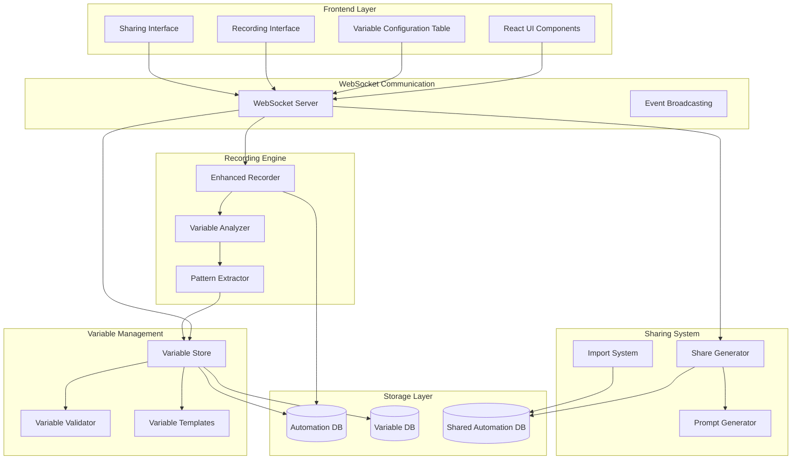

# Design Document

## Overview

The Enhanced Recording & Variable Management system will transform how users interact with browser automations by providing intelligent variable extraction, intuitive customization interfaces, and seamless sharing capabilities. The design focuses on three core components: an enhanced recording engine with smart pattern detection, an interactive variable management interface, and a sharing system based on structured variable mappings and natural language prompts.

The system will integrate seamlessly with the existing Stagehand automation engine while adding sophisticated variable analysis, a React-based variable configuration interface, and a new sharing format that makes automations accessible to non-technical users.

## Architecture

### High-Level Architecture



### Component Architecture

The system extends the existing browser automation architecture with new specialized components:

1. **Enhanced Recording Engine**: Captures browser interactions with intelligent pattern recognition
2. **Variable Analysis System**: Processes recorded actions to extract and categorize variables
3. **Interactive Variable Interface**: React components for variable configuration and management
4. **Sharing & Import System**: Handles automation sharing via structured data and natural language
5. **Storage Extensions**: Enhanced database schemas for variable metadata and sharing

## Components and Interfaces

### Enhanced Recording Engine

**Purpose**: Capture browser interactions with advanced variable detection capabilities

**Key Components**:
- `EnhancedRecorder`: Main recording orchestrator
- `ActionCapture`: Captures detailed browser interactions
- `ElementAnalyzer`: Analyzes DOM elements for variable potential
- `PatternDetector`: Identifies data patterns in user inputs

**Interface**:
```typescript
interface EnhancedRecorder {
  startRecording(sessionId: string, options: RecordingOptions): Promise<void>
  stopRecording(sessionId: string): Promise<RecordingResult>
  captureAction(action: BrowserAction): Promise<void>
  analyzeVariables(): Promise<VariableCandidate[]>
}

interface RecordingOptions {
  enableVariableDetection: boolean
  sensitiveDataHandling: 'mask' | 'exclude' | 'flag'
  patternDetectionLevel: 'basic' | 'advanced' | 'comprehensive'
}

interface BrowserAction {
  type: 'click' | 'type' | 'select' | 'navigate' | 'wait'
  element: ElementInfo
  value?: string
  timestamp: number
  screenshot?: string
}

interface VariableCandidate {
  id: string
  name: string
  type: VariableType
  value: string
  confidence: number
  element: ElementInfo
  examples: string[]
  validation?: ValidationRule
}
```

### Variable Analysis System

**Purpose**: Process recorded actions to intelligently extract and categorize variables

**Key Components**:
- `VariableAnalyzer`: Main analysis engine
- `PatternMatcher`: Matches common data patterns (email, phone, date, etc.)
- `ContextAnalyzer`: Analyzes element context for better variable naming
- `ValidationGenerator`: Creates appropriate validation rules

**Interface**:
```typescript
interface VariableAnalyzer {
  analyzeRecording(actions: BrowserAction[]): Promise<VariableCandidate[]>
  categorizeVariable(value: string, context: ElementContext): VariableType
  generateValidation(variable: VariableCandidate): ValidationRule
  suggestVariableName(element: ElementInfo, value: string): string
}

interface ElementContext {
  label?: string
  placeholder?: string
  fieldType?: string
  parentForm?: string
  siblingElements?: ElementInfo[]
}

type VariableType = 
  | 'email' | 'name' | 'phone' | 'date' | 'url' | 'number' 
  | 'currency' | 'text' | 'select' | 'checkbox' | 'file' | 'sensitive'

interface ValidationRule {
  required?: boolean
  pattern?: string
  minLength?: number
  maxLength?: number
  min?: number
  max?: number
  options?: string[]
  customMessage?: string
}
```

### Interactive Variable Interface

**Purpose**: Provide intuitive React components for variable configuration

**Key Components**:
- `VariableConfigurationTable`: Main table interface for variable management
- `VariableEditor`: Individual variable editing component
- `ValidationRuleBuilder`: Interface for creating validation rules
- `VariablePreview`: Shows how variables will be used in automation

**React Components**:
```typescript
interface VariableConfigurationTableProps {
  variables: Variable[]
  onVariableUpdate: (id: string, updates: Partial<Variable>) => void
  onValidationTest: (variable: Variable) => Promise<ValidationResult>
  readonly?: boolean
}

interface VariableEditorProps {
  variable: Variable
  onChange: (updates: Partial<Variable>) => void
  onValidate: (value: string) => ValidationResult
  showAdvanced?: boolean
}

interface Variable {
  id: string
  name: string
  type: VariableType
  value: string
  defaultValue?: string
  description: string
  examples: string[]
  validation: ValidationRule
  sensitive: boolean
  required: boolean
  category: string
}
```

### Sharing & Import System

**Purpose**: Enable automation sharing through structured variable mappings and natural language

**Key Components**:
- `ShareGenerator`: Creates shareable automation packages
- `PromptGenerator`: Converts actions to natural language descriptions
- `ImportProcessor`: Handles importing shared automations
- `CompatibilityChecker`: Ensures shared automations can run in target environment

**Interface**:
```typescript
interface ShareGenerator {
  createSharePackage(automationId: string, options: ShareOptions): Promise<SharePackage>
  generatePrompts(actions: BrowserAction[]): Promise<ActionPrompt[]>
  validateSharePackage(package: SharePackage): ValidationResult
}

interface SharePackage {
  id: string
  name: string
  description: string
  version: string
  author: string
  created: Date
  variables: Variable[]
  prompts: ActionPrompt[]
  metadata: AutomationMetadata
  dependencies?: string[]
}

interface ActionPrompt {
  step: number
  action: string
  description: string
  variables: string[]
  element?: string
  condition?: string
}

interface ShareOptions {
  includeSensitiveVariables: boolean
  generateExamples: boolean
  includeScreenshots: boolean
  compressionLevel: 'none' | 'basic' | 'aggressive'
}
```

## Data Models

### Variable Storage Schema

```sql
-- Variables table for storing variable definitions
CREATE TABLE variables (
    id UUID PRIMARY KEY,
    automation_id UUID REFERENCES automations(id),
    name VARCHAR(255) NOT NULL,
    type VARCHAR(50) NOT NULL,
    value TEXT,
    default_value TEXT,
    description TEXT,
    examples JSONB,
    validation_rules JSONB,
    sensitive BOOLEAN DEFAULT FALSE,
    required BOOLEAN DEFAULT FALSE,
    category VARCHAR(100),
    confidence_score DECIMAL(3,2),
    created_at TIMESTAMP DEFAULT NOW(),
    updated_at TIMESTAMP DEFAULT NOW()
);

-- Variable usage tracking
CREATE TABLE variable_usage (
    id UUID PRIMARY KEY,
    variable_id UUID REFERENCES variables(id),
    execution_id UUID,
    value_used TEXT,
    success BOOLEAN,
    error_message TEXT,
    execution_time TIMESTAMP DEFAULT NOW()
);

-- Shared automations
CREATE TABLE shared_automations (
    id UUID PRIMARY KEY,
    original_automation_id UUID REFERENCES automations(id),
    share_package JSONB NOT NULL,
    created_by UUID,
    created_at TIMESTAMP DEFAULT NOW(),
    download_count INTEGER DEFAULT 0,
    rating DECIMAL(2,1),
    tags TEXT[]
);
```

### Enhanced Automation Schema

```sql
-- Extend existing automations table
ALTER TABLE automations ADD COLUMN variable_count INTEGER DEFAULT 0;
ALTER TABLE automations ADD COLUMN recording_metadata JSONB;
ALTER TABLE automations ADD COLUMN share_settings JSONB;

-- Recording sessions for better tracking
CREATE TABLE recording_sessions (
    id UUID PRIMARY KEY,
    automation_id UUID REFERENCES automations(id),
    started_at TIMESTAMP DEFAULT NOW(),
    completed_at TIMESTAMP,
    actions_captured INTEGER DEFAULT 0,
    variables_detected INTEGER DEFAULT 0,
    session_metadata JSONB
);
```

## Error Handling

### Variable Validation Errors

The system implements comprehensive error handling for variable validation:

1. **Type Validation**: Ensures variable values match their declared types
2. **Format Validation**: Validates patterns like email, phone, date formats
3. **Range Validation**: Checks numeric ranges and string lengths
4. **Dependency Validation**: Ensures dependent variables are properly configured
5. **Execution Validation**: Validates variables can be used in target automation context

**Error Response Format**:
```typescript
interface ValidationError {
  variableId: string
  field: string
  message: string
  code: string
  suggestions?: string[]
}

interface ValidationResult {
  valid: boolean
  errors: ValidationError[]
  warnings: ValidationError[]
}
```

### Recording Error Recovery

The enhanced recording system includes robust error recovery:

1. **Element Detection Failures**: Fallback to alternative element identification methods
2. **Variable Extraction Failures**: Graceful degradation with manual variable definition options
3. **Pattern Recognition Failures**: Allow manual pattern specification and learning
4. **Session Interruption**: Automatic session recovery and partial recording preservation

## Testing Strategy

### Unit Testing

**Variable Analysis Testing**:
- Pattern recognition accuracy for different data types
- Variable naming suggestion quality
- Validation rule generation correctness
- Edge case handling for complex form interactions

**Interface Testing**:
- Variable table functionality and user interactions
- Form validation and error display
- Real-time variable preview updates
- Accessibility compliance for all components

### Integration Testing

**Recording Integration**:
- End-to-end recording with variable extraction
- WebSocket communication during recording sessions
- Database persistence of variables and metadata
- Cross-browser compatibility for recording features

**Sharing Integration**:
- Complete share package generation and import
- Variable compatibility across different environments
- Natural language prompt generation accuracy
- Import validation and error handling

### Performance Testing

**Variable Processing Performance**:
- Large automation variable extraction speed
- Real-time variable validation performance
- Database query optimization for variable operations
- Memory usage during complex variable analysis

**User Interface Performance**:
- Variable table rendering with large datasets
- Real-time validation feedback responsiveness
- Smooth scrolling and interaction in variable interfaces
- Mobile device compatibility and performance

### User Acceptance Testing

**Recording Experience**:
- Intuitive recording start/stop workflow
- Clear variable detection feedback
- Understandable variable categorization
- Effective error messaging and guidance

**Variable Management Experience**:
- Easy variable customization and validation
- Clear understanding of variable usage in automation
- Effective sharing and import workflows
- Helpful documentation and examples

The testing strategy ensures the enhanced recording and variable management system provides a reliable, performant, and user-friendly experience while maintaining compatibility with the existing automation infrastructure.