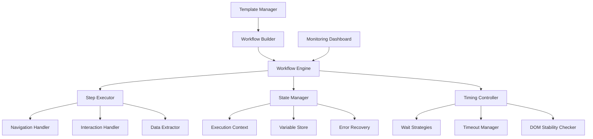
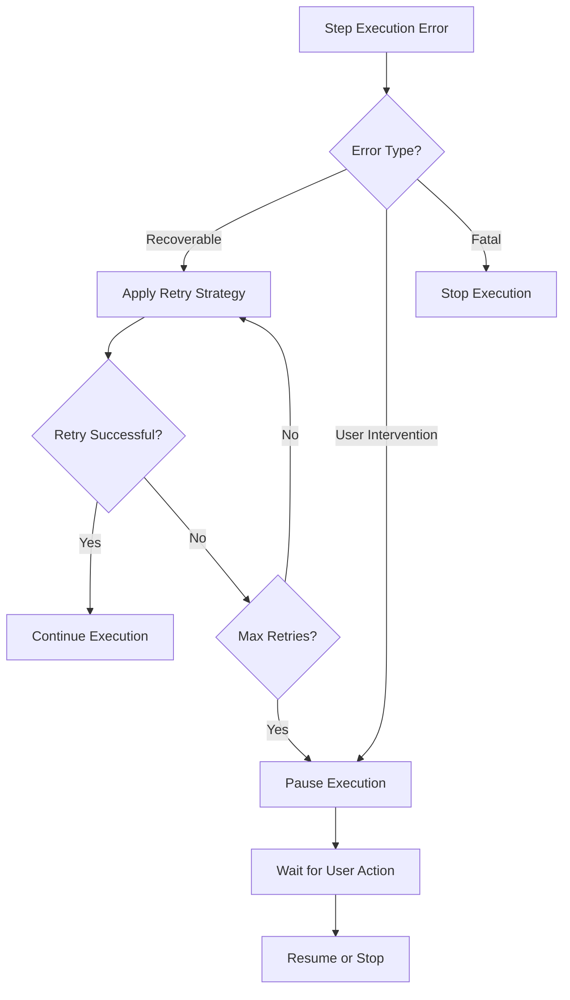

# Design Document

## Overview

The Sequential Automation Execution system will transform the current step-by-step execution model into a comprehensive workflow engine capable of handling complex, multi-step automation sequences. The design focuses on creating a robust execution pipeline that can handle navigation, timing, error recovery, and conditional logic while providing real-time monitoring and control capabilities.

## Architecture

### Core Components



### Execution Pipeline

The system will implement a pipeline-based execution model:

1. **Workflow Parsing**: Convert automation definitions into executable workflows
2. **Context Initialization**: Set up execution environment and variables
3. **Sequential Execution**: Process steps in order with proper timing
4. **State Management**: Maintain execution state and handle interruptions
5. **Error Handling**: Implement retry logic and recovery mechanisms
6. **Result Aggregation**: Collect and report execution results

## Components and Interfaces

### 1. Workflow Engine

**Purpose**: Central orchestrator for automation execution

**Key Methods**:
- `executeWorkflow(workflow, context)`: Execute complete automation sequence
- `pauseExecution()`: Pause current workflow execution
- `resumeExecution()`: Resume paused workflow
- `stopExecution()`: Stop and cleanup current workflow
- `getExecutionStatus()`: Get current execution state and progress

**State Management**:
- Execution queue with step ordering
- Variable context with scope management
- Error state tracking and recovery options
- Progress tracking with step completion status

### 2. Step Executor

**Purpose**: Execute individual automation steps with proper timing and error handling

**Key Methods**:
- `executeStep(step, context)`: Execute single automation step
- `validateStepPreconditions(step)`: Check if step can be executed
- `handleStepError(error, step)`: Handle step execution errors
- `waitForStepCompletion(step)`: Wait for step to complete fully

**Step Types**:
- Navigation steps (goto, back, forward, refresh)
- Interaction steps (click, type, select, scroll)
- Extraction steps (getText, getAttribute, getMultiple)
- Validation steps (checkExists, validateContent)
- Control flow steps (if, loop, wait, delay)

### 3. Timing Controller

**Purpose**: Handle all timing-related aspects of automation execution

**Key Methods**:
- `waitForPageLoad()`: Wait for page to fully load
- `waitForElement(selector, options)`: Wait for element availability
- `waitForStability()`: Wait for DOM to stabilize
- `adaptiveTimeout(operation)`: Adjust timeouts based on conditions

**Wait Strategies**:
- Fixed delays for known timing requirements
- Dynamic waits based on network conditions
- Element-based waits for interactive components
- Content-based waits for dynamic loading

### 4. Navigation Handler

**Purpose**: Manage page navigation and state transitions

**Key Methods**:
- `navigateToUrl(url, options)`: Navigate with proper waiting
- `handlePageTransition()`: Manage page state changes
- `detectNavigationComplete()`: Determine when navigation is done
- `maintainSessionState()`: Preserve session across navigation

**Features**:
- Automatic page load detection
- Session state preservation
- Cookie and storage management
- Redirect handling

### 5. Conditional Logic Engine

**Purpose**: Handle branching and conditional execution

**Key Methods**:
- `evaluateCondition(condition, context)`: Evaluate conditional expressions
- `executeBranch(branch, context)`: Execute conditional branch
- `handleMultiplePaths(paths, context)`: Choose appropriate execution path

**Condition Types**:
- Element existence conditions
- Content matching conditions
- Variable value conditions
- Page state conditions
- Custom JavaScript conditions

## Data Models

### Workflow Definition

```typescript
interface WorkflowDefinition {
  id: string;
  name: string;
  description: string;
  version: string;
  steps: WorkflowStep[];
  variables: VariableDefinition[];
  settings: WorkflowSettings;
  metadata: WorkflowMetadata;
}

interface WorkflowStep {
  id: string;
  type: StepType;
  name: string;
  action: string;
  target?: string;
  value?: string;
  conditions?: Condition[];
  timeout?: number;
  retryOptions?: RetryOptions;
  onError?: ErrorHandler;
}

interface ExecutionContext {
  workflowId: string;
  sessionId: string;
  variables: Map<string, any>;
  currentStep: number;
  executionState: ExecutionState;
  startTime: Date;
  errors: ExecutionError[];
  results: StepResult[];
}
```

### Execution State

```typescript
enum ExecutionState {
  PENDING = 'pending',
  RUNNING = 'running',
  PAUSED = 'paused',
  COMPLETED = 'completed',
  FAILED = 'failed',
  CANCELLED = 'cancelled'
}

interface StepResult {
  stepId: string;
  status: StepStatus;
  startTime: Date;
  endTime?: Date;
  result?: any;
  error?: ExecutionError;
  retryCount: number;
}
```

## Error Handling

### Error Recovery Strategies

1. **Retry Mechanisms**:
   - Exponential backoff for network-related errors
   - Element wait retry for timing issues
   - Page refresh retry for loading problems

2. **Fallback Procedures**:
   - Alternative selectors for element targeting
   - Alternative navigation paths for blocked routes
   - Manual intervention points for complex scenarios

3. **Error Classification**:
   - Recoverable errors (retry automatically)
   - User intervention errors (pause for manual fix)
   - Fatal errors (stop execution with detailed report)

### Error Handling Flow



## Testing Strategy

### Unit Testing
- Individual component testing for each engine component
- Mock browser interactions for isolated testing
- Error scenario simulation and recovery testing

### Integration Testing
- End-to-end workflow execution testing
- Multi-page navigation flow testing
- Variable passing and state management testing
- Error recovery and retry mechanism testing

### Performance Testing
- Large workflow execution performance
- Memory usage during long-running automations
- Concurrent workflow execution testing
- Resource cleanup and garbage collection testing

### User Acceptance Testing
- Real-world automation scenario testing
- Complex business process automation
- Error handling and recovery user experience
- Monitoring and control interface usability

## Implementation Phases

### Phase 1: Core Workflow Engine
- Implement basic workflow execution pipeline
- Add sequential step processing
- Create execution context management
- Implement basic error handling

### Phase 2: Advanced Timing and Navigation
- Add sophisticated wait strategies
- Implement navigation state management
- Create adaptive timeout mechanisms
- Add DOM stability detection

### Phase 3: Conditional Logic and Branching
- Implement conditional execution engine
- Add branching and loop support
- Create variable-based decision making
- Add custom condition evaluation

### Phase 4: Monitoring and Control
- Create real-time execution monitoring
- Add pause/resume functionality
- Implement execution reporting
- Create workflow debugging tools

### Phase 5: Templates and Reusability
- Implement workflow templates
- Add component library
- Create sharing and import/export
- Add version management